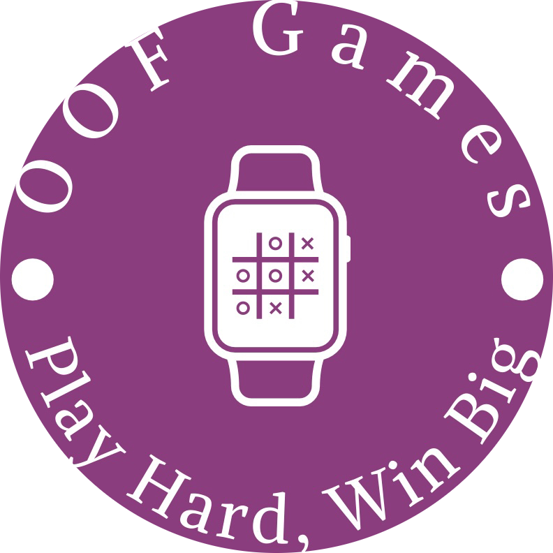
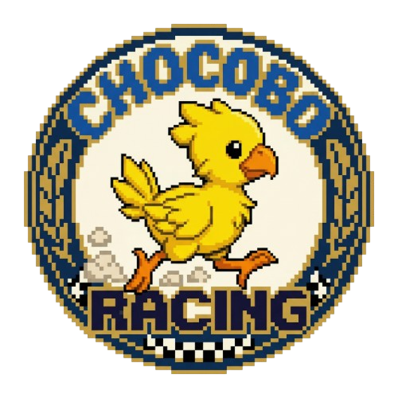
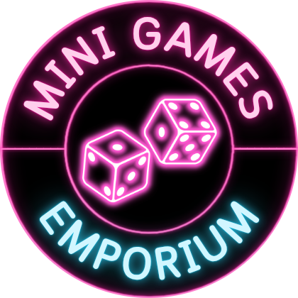

# OOFGames Plugins

Welcome to the custom repository for OOFGames Dalamud Plugins!

---

## 🏁 Chocobo Racing Gamba

Host Chocobo Racing Gamba with your friends in Eorzea! Players pick a chocobo to bet on, the host rolls `/random` to advance chocobos, and the first to reach the finish line wins.

### How to Install
Type `/xlsettings` in the in-game chat. 
Go to the **Experimental** tab. 
Paste this link into the Custom Plugin Repositories at the bottom: 
`https://raw.githubusercontent.com/OOFGamesss/OOFGamesPlugins/main/pluginmaster.json` 
Click the **+** button, ensure it is **Enabled**, and click **Save and Close**. 
Type `/xlplugins`, search for **Chocobo Racing Gamba**, and click Install!

### Commands
 `/crg` or `/chocoboracinggamba` - Opens the main UI.

### Authorisation
To host a race, you must be whitelisted. Please contact Felix on the OOFGames Discord to request Host access. All players can use the plugin to view the race without authorisation!

---

## 🎲 Gamba Where

Find and host FFXIV gambling events near you. **Gamba Where** is a Dalamud plugin that lets players discover active gamba sessions and host their own with configurable rules, presets, and automatic location updates.

[Find out more about Gamba Where](https://github.com/OOFGamesss/GambaWhere)

### How to Install
Type `/xlsettings` in the in-game chat. 
Go to the **Experimental** tab. 
Paste this link into the Custom Plugin Repositories at the bottom: 
`https://raw.githubusercontent.com/OOFGamesss/OOFGamesPlugins/main/pluginmaster.json` 
Click the **+** button, ensure it is **Enabled**, and click **Save and Close**. 
Type `/xlplugins`, search for **Gamba Where**, and click Install!

### Commands
 `/gambawhere` or `/gw` - Opens the main plugin window. 
`/gambawhereconfig` - Opens directly to the settings tab.

---

## 🎮 Mini Games Emporium

The official mini game hub for OOF Games. **Mini Games Emporium** is a Dalamud plugin that handles everything a host needs: player queues, session tracking, trade verification, automated chat announcements, and a full transaction ledger.

[Find out more about Mini Games Emporium](https://github.com/OOFGamesss/MiniGamesEmporium)

### How to Install
Type `/xlsettings` in the in-game chat. 
Go to the **Experimental** tab. 
Paste this link into the Custom Plugin Repositories at the bottom: 
`https://raw.githubusercontent.com/OOFGamesss/OOFGamesPlugins/main/pluginmaster.json` 
Click the **+** button, ensure it is **Enabled**, and click **Save and Close**. 
Type `/xlplugins`, search for **Mini Games Emporium**, and click Install!

### Commands
 `/mge` or `/minigamesemporium` - Opens the main plugin window. 
`/mgeconfig` - Opens directly to the Settings tab.

---

**[Join the OOFGames Discord!](https://discord.gg/vM6ff4h5Ym)**

