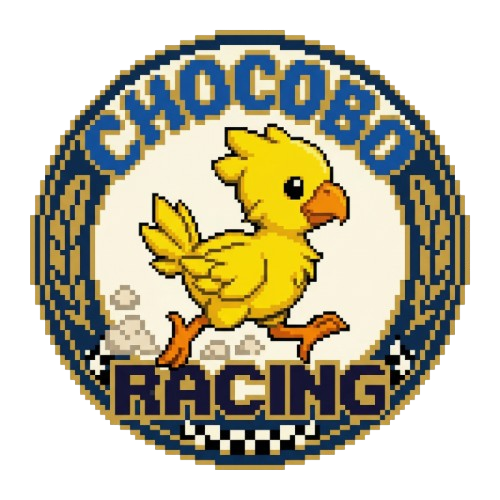

# OOF Games Plugins

Welcome to the custom repository for OOF Games Dalamud Plugins!

Find more details about the games on the [OOF Games Website](https://oofgames.fyi)

---

## 💠 Aetheric Flow

Teleport to any map link in chat with one click. **Aetheric Flow** is a Dalamud plugin that spots map links in chat and adds a clickable teleport link to the nearest aetheryte you have attuned to, with an `/aftp` command so controller players can teleport straight from a macro. 

[Find out more about Aetheric Flow](https://github.com/OOFGamesss/AethericFlow?v=2)

### How to Install
Type `/xlplugins`, search for **Aetheric Flow**, and click Install!

### Commands
 `/aethericflow` - Opens the configuration window. 
`/aftp` or `/aethericflowtp` - Teleports to the aetheryte from the most recent map link in chat.

---

## 🏁 Chocobo Racing

Host Chocobo Racing with your friends in Eorzea! Players pick a chocobo to bet on, the host rolls `/random` to advance chocobos, and the first to reach the finish line wins.

[Find out more about Chocobo Racing](https://github.com/OOFGamesss/ChocoboRacing)

### How to Install
Type `/xlsettings` in the in-game chat. 
Go to the **Experimental** tab. 
Paste this link into the Custom Plugin Repositories at the bottom: 
`https://puni.sh/api/repository/oof-games` 
Click the **+** button, ensure it is **Enabled**, and click **Save and Close**. 
Type `/xlplugins`, search for **Chocobo Racing**, and click Install!

### Commands
 `/cr` or `/chocoboracing` - Opens the main UI.

---

## 🎲 Gamba Where

Find and host FFXIV gambling events near you. **Gamba Where** is a Dalamud plugin that lets players discover active gamba sessions and host their own with configurable rules, presets, and automatic location updates.

[Find out more about Gamba Where](https://github.com/OOFGamesss/GambaWhere)

### How to Install
Type `/xlsettings` in the in-game chat. 
Go to the **Experimental** tab. 
Paste this link into the Custom Plugin Repositories at the bottom: 
`https://puni.sh/api/repository/oof-games` 
Click the **+** button, ensure it is **Enabled**, and click **Save and Close**. 
Type `/xlplugins`, search for **Gamba Where**, and click Install!

### Commands
 `/gambawhere` or `/gw` - Opens the main plugin window. 
`/gambawhereconfig` - Opens directly to the settings tab.

---

## 🎮 Mini Games Emporium

The official mini game hub for OOF Games. **Mini Games Emporium** is a Dalamud plugin that handles everything a host needs: player queues, session tracking, trade verification, automated chat announcements, and a full transaction ledger.

[Find out more about Mini Games Emporium](https://github.com/OOFGamesss/MiniGamesEmporium)

### How to Install
Type `/xlsettings` in the in-game chat. 
Go to the **Experimental** tab. 
Paste this link into the Custom Plugin Repositories at the bottom: 
`https://puni.sh/api/repository/oof-games` 
Click the **+** button, ensure it is **Enabled**, and click **Save and Close**. 
Type `/xlplugins`, search for **Mini Games Emporium**, and click Install!

### Commands
 `/mge` or `/minigamesemporium` - Opens the main plugin window. 
`/mgeconfig` - Opens directly to the Settings tab.

---

## 🎭 Truth or Dare

Run Truth or Dare rounds at your venue without tracking rolls by hand. **Truth or Dare** is a Dalamud plugin that opens a timed entry window, records every player's roll, and works out who asks and who answers, with editable prompt lists, per-channel announcements, and saveable settings profiles.

[Find out more about Truth or Dare](https://github.com/OOFGamesss/TruthOrDare)

### How to Install
Type `/xlsettings` in the in-game chat. 
Go to the **Experimental** tab. 
Paste this link into the Custom Plugin Repositories at the bottom: 
`https://puni.sh/api/repository/oof-games` 
Click the **+** button, ensure it is **Enabled**, and click **Save and Close**. 
Type `/xlplugins`, search for **Truth or Dare**, and click Install!

### Commands
 `/tod` - Opens the main plugin window. 
`/tod config` - Opens directly to the settings section. 
`/todstart` - Starts a round. 
`/todstop` - Cancels the round in progress.

---

**[Join the OOF Games Discord!](https://discord.gg/vM6ff4h5Ym)**
**[Visit the OOF Games website for more game info!](https://oofgames.fyi)**

